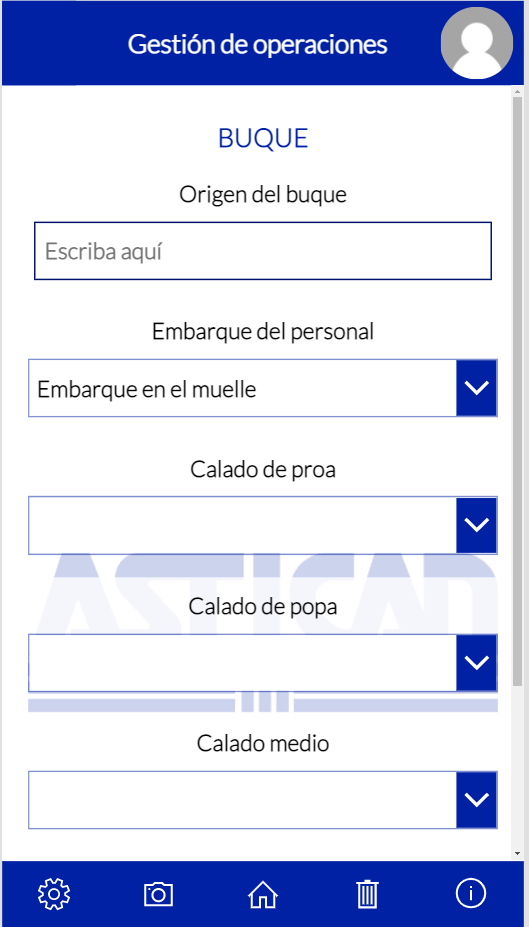

# Proyecto Astican : Documentación


## Índice
* [1. Introducción](#idIntroduccion)

* [2. Diagramas](#idDiagramas)
  * [2.1. Diagrama de entidad relacion](#idER)
  * [2.2. Modelo relacional](#idMR)

* [3. Requisitos de Usuario](#idReqUsu)

* [4. Casos de Uso](#idCasosDeUso)

* [5. Descripción del funcionamiento del sistema y especificaciones técnicas de la aplicación del servidor, móvil y web](#idDescripcion)

* [6. Interfaces](#idInterfaces)
  * [6.1. Diseño Inicial](#idDiseño)
  * [6.2. Usabilidad](#idUsabilidad)

* [7. Manuales](#idManuales)
  * [7.1. Manual Usuario](#idManualUsuario)
  * [7.2. Manual Instalacion](#idManualInstalacion)
  
* [8. Pila Tecnológica](#idPilaTecnologica)
  * [8.1. Microsoft Power Apps](#idPowerApps)
  * [8.2. Microsoft Excel](#idExcel)

* [9. Comparación de tecnologías](#idComparacionTecnologias)

* [10. Repositorios](#idRepositorios)

* [11. Planificación](#idPlanificacion)

* [12. Conclusiones](#idConclusiones)

* [13. Enlaces  y referencias](#idEnlaceReferencias)

## 1. Introducción<a name="idIntroduccion"></a>

La aplicación a desarrollar es para ASTICAN una empresa dedicada principalmente a la reparación de barcos tanto fuera como dentro del agua, es decir, es un astillero.
La idea de la aplicación surge de la necesidad de liberar de trabajo al encargado de llevar todo el procedimiento de sacar el barco del mar y llevarlo a la calle en la que se trabajará con él y también del proceso contrario, devolverlo al mar tras su reparación.
Esta aplicación deberá facilitar la labor del encargado recogiendo datos de forma automática y de forma manual que dicho usuario escribirá. Estos datos serán guardados en las listas de SharePoint que tiene la empresa para poder hacer un seguimiento de la duración media de cada operación así como la duración de todo el proceso entre otros.
La aplicación también debe permitir que otros usuarios que están relacionados con el proceso puedan ver en que estado se encuentra el mismo, evitando así llamadas telefónicas al encargado de todo el proceso. Con todo lo anterior dicho, se espera que la aplicación aumente la eficiencia del proceso anulando llamadas innecesarias y la toma de datos en papel para después ser pasada a ordenador.

## 2. Diagramas<a name="idDiagramas"></a>

### 2.1. Diagrama de entidad relación:<a name="idER"></a>


Este es el diagrama de entidad relación de la aplicación. Al ser tan grande los atributos no se muestran, estos serán mostrados en el modelo relacional en el siguiente apartado. Como se puede observar, existen varias tablas, estas tablas son "Barco", "Operación", "Incidencia", "Tipologia", "Varada", "Traslado en seco", "Botadura", "Traslado a flote", "FotosVarada", "FotosTrasladoEnSeco", "FotosBotadura", "FotosTrasladoAFlote" y por último "Tractor".
Cada una de las tablas tiene su propio identificador como clave primaria por lo que no pueden ser ni null ni se pueden repetir dentro de la misma tabla. Algunas tablas tienen una clave foránea debido a la relación que tienen con otras tablas, este es el caso de la tabla "Operación" que tiene una clave foránea proviniente de la tabla "Barcos", siendo la clave de "Operación",a su vez, clave foránea en las tablas "Varada", "Traslado en seco", "Botadura", "Traslado a flote" e "incidencias". Las tablas "Tipologia" y "FotosVarada" tienen como clave foránea la clave de la tabla "Varada" mientras que las otras tres tablas de fotos tienen como clave foránea las claves primarias de sus respectivas operaciones, es decir, "FotosTrasladoEnSeco" tiene la de "Traslado en seco", "FotosBotadura" tiene la de "Botadura" y "Traslado a flote" tiene la de "Traslado a flote".

En cuanto a las relaciones, son todas de uno a muchos excepto cuatro de ellas que pasarán a ser tablas más adelante debido a la relación de muchos a muchos que forman entre la tabla "Tractor" y las tablas "Varada", "Traslado en seco", "Botadura" y "Traslado a flote". Las cuatro relaciones mencionadas son "Varada_Tractor", "TrasladoEnSeco_Tractor", "Botadura_Tractor" y "TrasladoAFlote_Tractor" cada una de ellas tendrá como clave principal, el conjunto de las claves de "Tractor" y una de las claves de las tablas mencionadas anteriormente según les correpondan.

### 2.2. Modelo relacional:<a name="idMR"></a>


A lo dicho en el diagrama entidad relación se une el modelo relacional. Se puede ver todo el modelo de datos ya diseñado con todos sus atributos, la mayoría de ellos son de tipo "date". En un principio la mayoría de estos datos no podrán ser null.

Se puede ver también como las relaciones muchos a muchos se han transformado en tablas como se mencionó antes, estas son "Varada_Tractor", "TrasladoEnSeco_Tractor", "Botadura_Tractor" y "TrasladoAFlote_Tractor".

## 3. Requisitos de usuario<a name="idReqUsu"></a>

* La aplicación será ejecutada en móvil en principio aunque cabe la posibilidad de que acabe siendo ejecutada en tablets.

* Esta aplicación será utilizada por dos tipos de usuario, el gestor y los usuarios autorizados de Astican.

   * El gestor accederá al menú con todas las opciones, podrá agregar, editar, visualizar y eliminar datos.

   * Los usuarios autorizados de Astican solo podrán ver el estado de la operación actual y sus detalles.
   
* Los usuarios para poder entrar en la aplicación deben tener el permiso en su cuenta de Office365.

* La aplicación tendrá dos interfaces de inicio diferentes.

  * La interfaz del gestor será un menú con 2 botones, uno de ellos para las operaciones y uno para ver un resumen de todas las operaciones.
    
    * Las operaciones tendrán diferentes interfaces para rellenar datos.
    
    * El resumen te permite seleccionar cualquier operación y ver y editar sus datos, esta interfaz tendrá un scroll para ver todas las operaciones y permitirá la búsqueda por nombre de barco y operación. También contiene 5 botones que sirven para filtrar por tipos de operaciones.
    
  * La interfaz de los usuarios autorizados de Astican consistirá en la pantalla de detalles de la última operación y de la pantalla de configuración.
  
* En caso de que hubiese algún problema con el origen de datos, se mostraría un mensaje de error en pantalla.

* Ningún dato puede quedar en blanco, hasta que todos los datos de un paso estén rellenos, la app no permitirá el avance.

## 4. Casos de Uso<a name="idCasosDeUso"></a>

De los requisitos de usuarios mencionados en el anterior apartado surge este diagrama de casos de uso.


<a name="idDescripcion"></a>
## 5. Descripción del funcionamiento del sistema y especificaciones técnicas de la aplicación

La aplicacións será utilizada por dos tipos de usuario, el gestor y el usuario autorizado de Astican. Una vez se inicia la aplicación habrá dos posibilidades, una de ellas es que se abra exclusivamente la pantalla de detalles de la última operación y la otra es que se abra el menú desde el que se puede acceder a todas las opciones de la aplicación, esto último sucederá si es el gestor el que inicia la aplicación mientras que si es un usuario de Astican solo podrá ver los detalles de la última operación.

Una vez en el menú, el gestor podrá crear las cuatro operaciones para las que ha sido pensada la aplicación. Las operaciones deberán realizarse de manera secuencial es decir, cuando comienza una varada por ejmeplo debe seguir todos los pasos hasta acabarla, hasta que no se acabe no podrá salir ni volver atrás. Si desea modificar deberá acceder al visualizador mediante el botón que se encuentra en el menú y elegir la operación que desea editar. En cada paso el gestor tendrá la posibilidad de sacar una o varias fotos que luego podrá visualizar, esta función se encuentra disponible en el menú de editar también.

Ambos usuarios tienen la posibilidad de activar o desactivar el modo oscuro según prefieran.

## 6. Interfaces<a name="idInterfaces"></a>

### 6.1. Diseño Inicial:<a name="idDiseño"></a>

Al entrar en la aplicación como usuario de Astican solo podrás ver los detalles de la última operación, al ser 4 operaciones diferentes, en la misma interfaz se juega con la visibilidad de la información para mostrar la adecuada, debido a la cantidad de datos que hay, se ha optado por hacer una ventana con scroll que muestre toda la información. Cabe destacar que esta interfaz es la misma que la de detalles que verá el gestor pero sin el icono del lápiz que activará el modo de edición de la operación ni el icono de la cámara que le llevará a la ventana de imágenes como se verá más adelante. La flecha superior izquierda sirve para salir en el caso de los usuarios de Astican y para volver atrás en el caso del gestor. Se puede observar como en la parte inferior hay un footer con un engranaje y un icono de exclamación, el engranaje lleva a la ventana de configuración y el icono de la exclamación abrirá la ayuda de la aplicación.

En la ventana de configuración se muestra un botón de cambio a modo oscuro. A continuación se muestran capturas de esta ventana normal y en modo oscuro además del visualizador de usuarios de ASTICAN.


En cuanto al gestor, es la única persona que hará uso de todas las funcionalidades de la aplicación, al iniciar la aplicación entrará a su menú. En el menú encontrará un botón para crear las operaciones que puede realizar y un botón que le muestra una previsualización de las operaciones.

El botón "nueva operación" llevan a las ventanas donde se muestran los pasos de cada operación mientras que el botón "visualizador" permite como ya ha sido mencionado, previsualizar las operaciones que ya han sido realizadas.

Se puede ver el mismo footer que se encuentra en el menú del resto de usuarios con las mismas opciones.

En esta pantalla aparece un botón para volver a la operación justo en el punto en que se dejó cuando se salió de esta para regresar al menú.


Cada operación tiene sus pasos aunque algunos son comunes entre ellos. El primer paso es el de "Inicio", este es común en todas las operaciones, por esto esta interfaz es la misma para las 4 operaciones. Hay un desplegable que permite seleccionar la operación y el segundo desplegable está deshabilitado hasta seleccionar alguna, el segundo desplegable permite seleccionar el buque. En esta pantalla hay un botón para volver atrás y otro para ir al siguiente paso que no se habilitará hasta que no se rellenen todos los campos. Como se puede ver hay un footer, este es el mismo que el visto previamente pero jugando con la visibilidad se han habilitado dos opciones nuevas, la cámara abre el menú de imágenes mientras que la papelera permite borrar la operación que se está creando.


El siguiente paso en la varada es "Cama de varada" aquí se encuentran dos checkbox que recogen la fecha y hora del momento en el que son pulsados además de mostrar un mensaje que te indica la fecha y hora guardada, se encuentra también dos desplegables de selección múltiple que te dejarán elegir entre varias opciones para seleccionar la tipología y la viga de varada. Esta interfaz y el resto de interfaces relacionadas con las fases de las operaciones tienen los botones para volver atrás y para ir a la siguiente fase, estando este último deshabilitado hasta que se rellenen los campos de dicha interfaz. También en el resto de interfaces aparecerá un nuevo icono en el footer, este te llevará al menú principal y activará el botón que se vió previamente para volver a la operación en curso.


El siguiente paso es "Planificacion", es el tercer paso de la varada y el segundo del traslado en seco, traslado a flote y botadura. La primera imagen corresponde con la apariencia de la pantalla cuando es una varada, como se puede ver tiene dos desplegables de selección única que dan varias opciones, un checkbox que recoge la fecha y hora en la que es pulsado y dos desplegables para elegir la hora y dos para elegir los minutos. Se puede ver que tiene un scroll, lo que se encuentra más abajo son los botones comunes entre las interfaces de los pasos, el boton de ir a la siguiente fase y el de volver atrás.

En cuanto a la segunda imagen, que corresponde con el traslado en seco hay dos cuadros de texto normales, dos checkbox que recogen la fecha y hora actual cuando son pulsados y un desplegable para la hora y otro para los minutos. También tiene un scroll para que los botones comunes tengan espacio.

La tercera imagen corresponde con la botadura, es igual que el resto, se parece a la del traslado en seco pero con un cuadro de texto menos y con dos desplegables para horas y minutos más.

La última imagen es del traslado a flote, esta es la versión de la interfaz con más campos, tiene 2 campos de texto, 2 desplegables y 2 checkbox, al hacer scroll se encuentran otros dos desplegables uno para las horas y otro para los minutos además de los botones básicos de todos los pasos.


Tras pasar por la interfaz anterior, la varada pasa a la interfaz que corresponde con la fase "Buque" donde podemos observar cuatro desplegables, un cuadro de texto y un checkbox que se encuentra más abajo que sirve para lo mismo que los anteriores.

La segunda interfaz coincide con el tercer paso del traslado en seco y de la botadura, que se llama "primer movimiento" y tiene tres checkbox para recoger la fecha y hora. Esta interfaz es la misma para las dos operaciones.

La tercera interfaz es el paso de "tralado a flote" de la propia operación traslado a flote, hay tres checkbox y dos desplegables, el espacio en blanco que se ve es debido a que hay texto oculto que se hace visible una vez seleccionas el checkbox, como se vio previamente.




A continuación en la varada está la interfaz de la fase "Submarinistas", esta tiene un desplegable y dos checkbox para la fecha y hora además de los botones que tienen todas las interfaces de los pasos para cambiar de fase o volver atrás.


El siguiente paso es el denominado "Syncrolift" aquí hay tres checkbox que toman la fecha y hora actual cuando son pulsados.

En caso de la botadura no es el siguiente paso pero es una fase que coincide en ambas operaciones. En la botadura esta fase viene después de "remolque en seco" que se verá a continuación y que si que corresponde con el siguiente paso de la varada. Para la botadura esta interfaz es igual que para la varada pero tiene un checkbox menos y un cuadro de texto más.


La siguiente interfaz coincide con el cuarto paso del traslado en seco y botadura y con el séptimo de la varada, su nombre es "Remolque en seco" y en el caso de la varada presenta algunas diferencias con respecto a las otras dos operaciones. En la varada hay un desplegable que permite elegir una opción en carro de tiro y otro desplegable que deja elegir varias opciones mientras que en la interfaz del resto hay un checkbox para la fecha y hora, dos desplegables de selección individual y un desplegable de selección múltiple. La primera imagen coincide con la fase de la varada y la segunda con la del traslado en seco y la botadura.


"Servicios básicos" es la última interfaz para los pasos o fases y coincide en traslado en seco, traslado a flote y varada. En el caso de la botadura, su último paso se llama "maniobra a flote" y se llega a este desde la interfaz de syncrolift.

En "servicios básicos", hay tres checkbox que recogen la fecha y hora actual al ser presionados en el caso de la varada y el traslado en seco, en el traslado a flote hay un checkbox menos. Al darle al botón "guardar y finalizar" guardará los datos que corresponden y volverá a la pantalla de menú del gestor.

En "maniobra a flote" hay dos checkbox, un desplegable y un botón delizable, el botón de "guardar y finalizar" hace lo mismo que el de "servicios básicos"


Cuando se pulsa el botón de "ver operaciones" que hay en el menú del gestor, te llevará a esta pantalla, la pantalla "visualizador", que te permite ver las operaciones por orden de identificador, es un menú con scroll para ver todas las operaciones que salen con presentación de tarjetas. En el cuadro de texto se puede buscar por tipo de operación y por nombre de barco. Al pulsar sobre las flechas ubicadas a la derecha de cada tarjeta se abrirá la ventana de detalles de esa operación y si se pincha sobre la flecha de arriba a la izquierda se vuelve a la ventana anterior.


Hasta esta interfaz se navega al pulsar en las flechas que están a la derecha de las tarjetas. Como se puede ver es la misma interfaz que la de detalles de los usuarios de Astican pero con el icono del lápiz que lleva a la ventana de edición de la operación en cuestión. La información presentada dependerá del registro escogido y de su tipo de operación.


Esta es la ventana de edición de registros, también juega con la visibilidad ya que cada operación tiene datos distintos. Cuenta con scroll para editar todo lo necesario en la misma pantalla y al final del todo hay un botón que guaradará los cambios.


Como se puede ver, en la mayoría de interfaces aparece un icono de una cámara, al pulsar sobre él navegará hacia la interfaz dedicada a la adición de fotos, esta interfaz tiene dos versiones a pesar de ser la misma interfaz, a la primera se accede desde las interfaces de los pasos de cada operación y coincide con la primera imagen mostrada, a la segunda se accede desde la pantalla de edición y coincide con la segunda imagen. Como se puede ver ambas tienen un cuadro para insertar la imagen, al pulsar sobre el botón "añadir foto", esta se añadirá, en la segunda imagen hay un desplegable que sirve para indicar en que paso se quiere añadir dicha imagen, en la otra no hace falta ya que es automático debido a que se ingresa a la interfaz desde un paso concreto. Bajo el botón aparecen las imágenes en una tarjeta, junto con el paso en el que han sido sacadas y un icono de papelera, este sirve para borrar esa imagen. En la esquina superior derecha hay una flecha de actualización, esta actualizará la lista de imágenes al ser pulsada. Por último en la esquina superior izquierda se encuentra la flecha que sirve para volver a la página anterior.


### 6.2. Usabilidad:<a name="idUsabilidad"></a>

* La aplicación es útil, cumpliendo todos los requisitos de la empresa, tomar datos sobre las operaciones, visualizarlos y editarlos.


* Prevee errores, permitiendo la edición de los datos añadidos y mostrando mensajes de error cuando algún campo esta vacío.


* La interfaz goza de elegancia con una paleta de colores bastante pequeña, los colores utilizados son el azul oscuro, blanco y algo de negro como se ve en imágenes anteriores.


* Es fácil de aprender y de entender, con iconos y textos explicativos.


* El usuario debe ser capaz de iniciar acciones y controlar tareas.


* El usuario es capaz de personalizar la interfaz.


* El usuario es capaz de acceder a todo el contenido que tiene permitido utilizar.


* Es eficiente: mide el esfuerzo para conseguir un objetivo.


* Ofrece beneficios, ahorra tiempo al usuario y mejora su eficiencia.


* La interfaz posee una simplicidad en el diseño, no existe sobrecarga.


* El usuario debe ser capaz de interactuar con la aplicación.


## 7. Manuales<a name="idManuales"></a>

### 7.1. Manual de usuario:<a name="idManualUsuario"></a>
* [7.1.1. Funciones Basicas](#idFbasicas)
* [7.1.2. Solucion problemas](#idSproblemas)

#### 7.1.1. Funciones Básicas:<a name="idFbasicas"></a>
Si es un usuario de Astican con acceso a la aplicación solo podrá ver los detalles de la última operación, para salir de la aplicación pulse la flecha que hay en la esquina superior izquierda y para cambiar al modo oscuro dispone de un botón deslizable bajo el título de la pantalla para cambiarlo.

Si es el gestor de la aplicación dispondrá de cinco botones principales, los cuatro primeros le permetirán realizar las operaciones fase por fase rellenando cada uno de los campos y una vez se llegue al paso final la aplicación volverá al menú principal. El quinto botón le llevará a una página que le permetirá ver las operaciones ya hechas y podrá buscar por nombre de barco y por tipo de operación, si quiere ver más detalles pinche en la flecha que aparece al lado derecho de cada operación y si tras ver los detalles desea modificar alguna pinche sobre el lápiz que aparece en la esquina superior derecha. Una vez en la pestaña de edición modifique los registros que desee y pulse el botón de abajo del todo para guardar cambios. Si quiere ver las fotos añadidas pulse sobre la cámara que aparece arriba a la derecha, también tiene la opción de añadir más, esta opción también está disponible en cada fase de cada operación en el momento de crearla. Para volver al menú principal pulse en las flechas que aparecen arriba a la izquiera en cada pantalla hasta regresar al menú principal. De vuelta en el menú principal verá un engranaje, este desplegará un pequeño menú que le permitirá cambiar el modo de visualizavión de la aplicación.

#### 7.1.2. Solución de problemas:<a name="idSproblemas"></a>
Si al intentar editar o crear alguna operación sale un mensaje de error, asegúrese de que el origen de datos (el Excel) no está abierto, si es así, ciérrelo e intente editar o crear de nuevo.

### 7.2. Manual de instalacion:<a name="idManualInstalacion"></a>

Para instalar esta aplicación deberá importarla en su cuenta de Power Apps (en la web o en la aplicación de escritorio) o que el creador de la aplicación se la comparta. En algunos casos hay problemas para compartir el Excel así que es posible que necesite una copia de la base de datos. Es muy importante que no modifique nada de ese archivo Excel, deberá entrar en el modo de edición de la aplicación y deberá poner como origen de datos ese archivo Excel que previamente debe subir a una cuenta de Microsoft OneDrive, es decir, subirá el Excel a una cuenta de OneDrive y creará una nueva conexión con esa cuenta. Para crear la conexión vaya al apartado "datos" dentro del editor de la aplicación, seleccione el apartado "conectores" y elija la opción de OneDrive, agregue la conexión con la cuenta en la que tiene el Excel y elíjala, una vez hecho esto le aparecerá el Excel, selecciónelo y le aparecerán las tablas, selecciónelas todas y añádalas a la aplicación, una vez hecho esto, debería funcionar correctamente.

## 8. Pila Tecnológica<a name="idPilaTecnologica"></a>

### 8.1 Microsoft Power Apps:<a name="idPowerApps"></a>
Es un software que requiere de licencia para explotar todo su potencial, aún así, se puede usar de forma gratuita ofreciendo una gran cantidad de sus recursos para el desarrollo sencillo de aplicaciones.
En Power Apps se puede desarrollar una aplicación desde 0 o a partir de un modelo de datos teniendo compatibilidad con infinidad de motores de bases de datos. Este software tiene un gran potencial, es capaz de crear una aplicación con su CRUD completo a partir de una tabla de una base de datos, una vez tengas esa aplicación puedes modificar la tabla y añadir más campos a tu aplicación. Ofrece un sin fin de funciones que te permiten trabajar con los datos de una manera simple e intuitiva.

Todo en Power Apps es de manera visual, vas arrastrando los objetos que necesitas sobre un lienzo que será tu pantalla, ofrece la posibilidad de modificar el diseño de dichos objetos y de cambiarle algunas de sus características para que funcionen tal y como el usuario desea. Ofrece una gran cantidad de funciones predefinidas por las que puedes programar las funciones de los objetos. Además, da la posibilidad de crear variables a las que le puedes asignar desde un simple integer a una tabla completa de tu origen de datos.

### 8.2 Microsoft Excel:<a name="idExcel"></a>
Microsoft Excel es una hoja de cálculo mundialmente conocida que también permite el almacenaje de datos en su sistema de celdas. Gracias a la creación de tablas que proporciona Excel, se pueden guardar los datos generados en la aplicación para más tarde visualizarlos o editarlos.

## 9. Comparación de tecnologías<a name="idComparacionTecnologias"></a>

Existen tres tipos principales de aplicaciones, las aplicaciones nativas, las aplicaciones web y las aplicaciones híbridas.

Una aplicación nativa es aquella que está desarrollada para un sistema operativo en concreto y solo funcionará en dicho sistema operativo, por lo que si quieres desarrollar una aplicación nativa para varios sistemas operativos, deberás crear tu aplicación tantas veces como sistemas operativos quieras cubrir trabajando en cada una con el entorno de desarrollo específico para cada sistema operativo.

Una aplicación web es una aplicación desarrollada para ser utilizada por los navegadores web por lo que no deberán ser instaladas en el dispositivo. Estas aplicaciones se desarrollan con CSS, HTML y JavaScript principalmente y se pueden utilizar en cualquier navegador web.

Una aplicación híbrida es aquella que combina a las dos anteriores tipos de aplicaciones, estas aplicaciones se instalan en los dispositivos a pesar de no estar desarrolladas para ningún sistema operativo en específico y hacen uso del navegador web para funcionar correctamente.

Por el funcionamiento de Power Apps diría que las aplicaciones que genera se tratan de aplicaciones híbridas ya que además de permitirte la creación de aplicaciones móviles permite la creación de aplicaciones para escritorio y tablets, además las aplicaciones se pueden reproducir desde la página de Power Apps en el navegador.

## 10. Repositorios<a name="idRepositorios"></a>

Este es el repositorio de GitHub en el que se encuentra la documentación:
```
https://github.com/acoidan-santana/proyectoAstican.git
```

## 11. Planificación<a name="idPlanificacion"></a>

Para comenzar con el proyecto lo primero que hizo fue verme varios vídeos sobre el funcionamiento de Power Apps dado que es una tecnología nueva y totalmente distinta a lo que estamos acostumbrados. Tras un par de días comencé a hacer una aplicación de prueba para investigar más a fondo el funcionamiento e intentar entender para que servía cada cosa y que funciones tenían. Comencé a trabajar con Google Sheets como origen de datos improvisado mientras descubríamos si podíamos trabajar en Excel, creé un total de 3 aplicaciones usando Google Sheets como origen de datos hasta que entendimos el funcionamiento de Power Apps con Excel online.

A medida que iba desarrollando las aplicaciones con Google Sheets empecé a estudiar un poco mejor la base de datos, creé un pequeño diagrama de entidad relación que poco a poco fui modificando y creé el diagrama de casos de uso.

Sobre el 13 de noviembre, con las ideas más claras sobre como usar Power Apps y como iba a ser la base de datos, empecé con el prototipado, fui haciendo el diseño poco a poco mientras seguía viendo algún vídeo sobre Power Apps, cuando acabé el prototipo empecé a trabajar un poco en la documentación. Con el prototipo, el diagrama de entidad relación y con una aplicación de prueba con Excel como origen de datos, me puse a desarrollar la aplicación que en un principio sería la final.

El día 1 de diciembre, Astican nos envía el borrador de lo que quieren en su aplicación y gracias a eso pude desarrollar todo el diagrama de entidad relación. El día 3, con el diagrama nuevo hecho, empiezo la aplicación final.

El día 12 de diciembre con la aplicación casi acabada, me puse a hacer el modelo relacional.

El día 13 de diciembre seguí ultimando la aplicación y a modificar y completar la documentación.

## 12. Conclusiones<a name="idConclusiones"></a>

En cuanto al desarrollo con Power Apps, si bien parece fácil de usar y de hacer aplicaciones con el, el hecho de ser totalmente distinto a cualquier lenguaje de programación y de tener ese sistema tan visual de trabajar con la aplicación, ha hecho que me resulte muy complicado desarrollar con él, a medida que he ido entendiendo como trabaja he ido haciendo las cosas más rápido. Hay ciertos limitantes en Power Apps que añaden mucha dificultad a la hora de desarrollar una aplicación grande como la que estoy desarrollando, he invertido muchísimas horas en ver por qué no me funcionaba una cosa u otra, cosas que probablemente con un lenguaje de programación normal se harían al instante. Una vez entiendes el funcionamiento, es muy fácil de usar y de aplicar las funciones predeterminadas que tiene. Sin duda lo mejor que tiene es que te quita el trabajo en cuanto a la conexión con la base de datos se refiere ya que lo hace todo él solo.

En relación al modelo de datos, ha sido bastante complicado obtener el modelo de datos que finalmente he realizdo, ya que es un proceso del que nunca había oído nada y no tenía idea alguna de que clase de datos recogían. Hasta que no nos enviaron el borrador de la aplicación junto con sus tablas de resúmenes no tuve mas o menos claro lo que pedían y aún con los datos hay alguna cosa que no entiendo bien.

Pasando al proyecto, me parece super interesante aunque se me ha hecho muy complicado entenderlo bien y poder desarrollar la aplicación en condiciones debido a lo comentado anteriormente.

## 13. Enlaces y referencias<a name="idEnlaceReferencias"></a>
Para entender el funcionamiento de Power Apps y como crear aplicaciones con este software me he valido principalmente de 3 fuentes:

_Canal de Youtube "Martín Gesualdo"_
```
https://www.youtube.com/channel/UCTc2Y5e4JYuVs7gc26pPynA/videos
```

_Canal de Youtube "Shane Young"_
```
https://www.youtube.com/c/ShaneYoungCloud/videos
```

_Documentación de Microsoft_
```
https://docs.microsoft.com/es-es/powerapps/powerapps-overview
```
